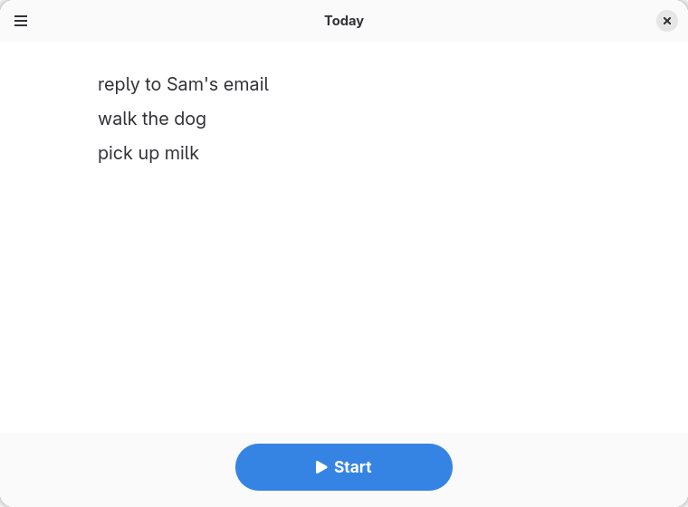

# Now Do This

A to-do app for today.

<br clear="left">

A calendar asks you to predict the unpredictable. A to-do list shows you
everything you have not done. Now Do This shows you one task, in large type,
and a button to say you have finished it.

| Write the day out | Then do it |
|---|---|
|  |  |

## How it works

Type the day out, one task per line, and press Start. Each task fills the
screen on its own until you mark it done, and the next one rises into its
place.

If something comes up while you are working, add it without leaving the task
at hand: it goes to the end of the list, so it never changes what you are
doing now. Whatever you do not finish is still there tomorrow.

There is no counter, no timer and no way to postpone. Those are the parts of a
to-do list that get you managing the list instead of doing the work.

## From the keyboard

The whole day can be run without reaching for the mouse.

| | |
|---|---|
| <kbd>Ctrl</kbd>+<kbd>Enter</kbd> | Start the list, or mark the task done |
| <kbd>Enter</kbd> | Mark the task done — the button takes focus on its own |
| <kbd>Ctrl</kbd>+<kbd>N</kbd> | Add a task without leaving the current one |
| <kbd>Ctrl</kbd>+<kbd>?</kbd> | Show the shortcuts |

<kbd>Enter</kbd> is left alone while you are writing the list, where it
separates one task from the next.

## Installing

Not on Flathub yet. To build and run it locally:

```sh
./scripts/run.sh
```

Or open the project in GNOME Builder and press <kbd>F5</kbd>, which builds and
runs it inside Flatpak.

## Building

```sh
./scripts/build.sh          # build into ./_install
./scripts/run.sh            # build, then run
./scripts/test.sh           # unit tests and metadata validation
./scripts/screenshots.sh    # regenerate the screenshots above
```

The scripts wrap Meson and Cargo; `scripts/build.sh` configures the build
directory on first use. `scripts/test.sh` runs the same target CI runs inside
the Flatpak sandbox.

## Your list is a text file

One task per line, at `~/.local/share/nowdothis/tasks.txt`. Read it, edit it
or back it up with anything you like — there is no database and no format to
learn.

## Credit

The idea is William Cotton and Jakob Lodwick's, from nowdothis.com. The site
is gone, so the name links to [an archived
copy](https://web.archive.org/web/20130121193906/http://www.nowdothis.com/).

## License

GPL-3.0-or-later. See [COPYING](COPYING).
